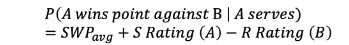
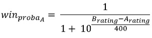
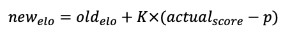
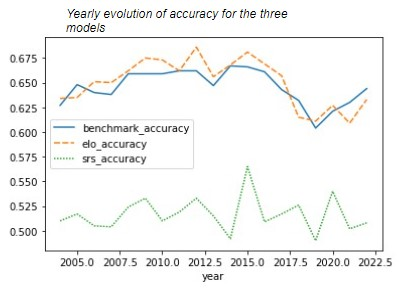
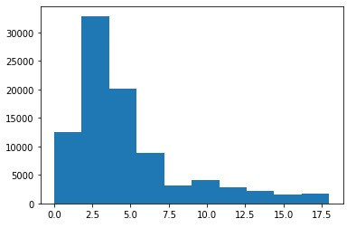
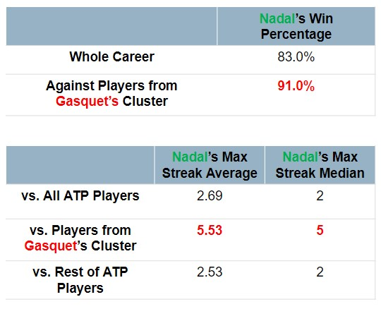

# A Study of an Extraordinary Tennis Winning Streak 

## Project Description 

In 1999, Gasquet beats Nadal in Junior World Championship. 23 years later : 18-0 for Nadal against Gasquet. 

**How unlikely is the 18-0 streak of matches between Rafael Nadal and Richard Gasquet in the ATP circuit ? How much is there luck v. skill ?** 

To answer this question, the following steps have been carried out: 
1) In-depth analysis of winning streaks between all ATP players since 2000 
2) Implementation of SRS (Simple Rating System) and ELO models to conduct match simulations and quantify the unlikeliness of that neverending winning streak
3) Clustering analysis of Top 100 ATP players to compare the performances against R. Nadal of players identified as similar to Gasquet’s playing style 

## Main results 

 

 

## Data Sources 

- [ATP Matches Scores](https://github.com/JeffSackmann/tennis_atp) 
- [ATP Detailed Point-by-Point, Shot-by-Shot Matches](https://github.com/JeffSackmann/tennis_MatchChartingProject) 

## References 

- [The Match Charting Project: Quick Start Guide - Jeff Sackmann](http://www.tennisabstract.com/blog/2015/09/23/the-match-charting-project-quick-start-guide)
- [Weighted Elo rating for tennis match predictions](https://www.sciencedirect.com/science/article/abs/pii/S0377221721003234) 
- [Are differences in ranks good predictors for Grand Slam tennis matches?](https://www.sciencedirect.com/science/article/abs/pii/S0169207009002076) 
